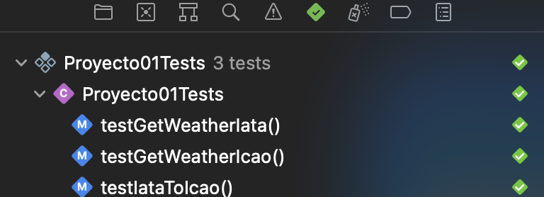

# Proyecto01 Modelado y Programación : Airport Weather

## Ricardo Emiliano Apodaca Cardiel 
### 0422029544

### Intro

This project is made to show airport weather using either [`IATA`](https://en.wikipedia.org/wiki/IATA_airport_code) or [`ICAO`](https://en.wikipedia.org/wiki/ICAO_airport_code). It is made on [Swift](https://www.swift.org)
and the UI in [Swift UI](https://developer.apple.com/xcode/swiftui/)
for Apple oparating systems, like iOS, macOS, and iPadOS.

### For execution

For the build and execution it is recomended to use Xcode, but for sure a mac is needed. Also you need to add the [Realm](https://realm.io) y it's 
[Swift SDK](https://www.mongodb.com/docs/realm/sdk/swift/#realm-swift-sdk),
since they are at the core of this project for find the equivalent `ICAO` code from a `IATA` code. Also a [CheckWX](https://www.checkwxapi.com) API key is needed to make use of the app.

### Use the app

1. Insert your API key in the field below and click `Save API key`.
2. Select which type of code your are to make a request. The default and faster is `ICAO`
3. Put your code on the field and wait for result, you need an internet connection.
4. Click on `Get Weather` and wait for result.
### App Feature

- Make request with `IATA`or `ICAO` codes.

- Altough a API key is needed, the app save your key beetween reopening and
restarting the device.

### App Demostration

### Test Succeeded

### Extras

- To add the packages : [MongoDB Explanation](https://www.mongodb.com/docs/realm/sdk/swift/install/)

- For building documentation: `Product > Build Documentation`

### Explanation PDF (in spanish)

The PDF explains a bit of the thought process, [here](Info/LaTeX/main.pdf) the link.
### Problemas Conocidos

- No corre correctament nativamente en macOS, si cuando se usa la contruccion de iPad.
